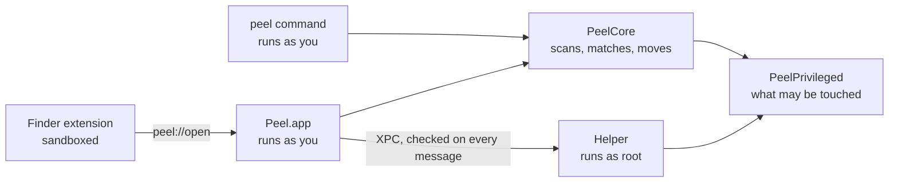

# How Peel is built

This page is for anyone who wants to read or change Peel's code. It describes the parts, how a removal travels
through them, and the few ideas that hold the whole thing together. [CONTRIBUTING.md](CONTRIBUTING.md) has the
rules a change has to keep, and [SAFETY.md](SAFETY.md) the full list of what Peel protects.

## The parts

Peel is four programs built from one Xcode project, and a Swift package that holds almost all of the logic.

| Part | Folder | Runs as | What it does |
|---|---|---|---|
| Peel.app | `Peel/` | You | The SwiftUI app: every page, and a model for each. |
| The helper | `PeelHelper/` | root | A launch daemon for the few things only an administrator can do: move items to the Trash and back, and start or stop another vendor's launch daemon. |
| The Finder extension | `PeelFinder/` | You, sandboxed | Adds Uninstall with Peel to Finder's menu for an app, and opens Peel with `peel://open?path=`. |
| The `peel` tool | `PeelCLI/` | You | The command line tool, shipped inside `Peel.app/Contents/Helpers`. |

The package, `Packages/PeelCore`, has three libraries:

- **PeelCore** decides and acts: it finds apps and their leftovers, measures folders, matches files to apps,
  and moves things to the Trash. It has no interface and speaks plain English; the app words everything a
  person reads.
- **PeelPrivileged** is the part the helper shares: which paths may be touched, what is protected, how a tool
  is run, and how a path is split into names. The helper links nothing else, so it stays small.
- **PeelCommandLine** holds the `peel` commands. `PeelCLI` is only their entry point.

Keeping the logic in the package is what makes it testable: `swift test --package-path Packages/PeelCore` runs
more than 900 tests without building the app.

## Where to start reading

- `Peel/PeelApp.swift`: the app's entry point, its windows, its menu commands, and the menu bar panel.
- `Peel/Views/ContentView.swift`: the main window, its sidebar, and how a page is chosen.
- `Packages/PeelCore/Sources/PeelCore/Removal/Uninstallation.swift`: what an uninstall offers, and what it selects
  for you.
- `Packages/PeelCore/Sources/PeelCore/Leftovers/LeftoverScanner.swift` and `LeftoverMatcher.swift`: where leftovers
  are looked for, and how each one is judged.
- `Packages/PeelCore/Sources/PeelCore/Removal/TrashService.swift` and `RemovalGuard.swift`: how an item moves to the
  Trash, and what is refused.
- `Packages/PeelCore/Sources/PeelPrivileged/ProtectedData.swift` and `PrivilegedPathPolicy.swift`: what nothing may
  remove, and what the helper may touch.
- `PeelHelper/HelperService.swift`: the helper's three operations.
- `Packages/PeelCore/Sources/PeelCommandLine/PeelCommand.swift` and `Support/Cleanup.swift`: the `peel` commands,
  and the one path every command that removes something takes.

## How a removal travels

Take the most common case, uninstalling an app. Every other page follows the same path with its own scanner.

1. **Scan.** `Uninstallation.prepare` asks `LeftoverScanner` to look through every place an app keeps files
   (`SearchLocation`): Application Support, Caches, Containers, Preferences, launch agents, plug-in folders, the
   top of the home folder, and more. A page's scan runs through its `ScanRun`, so a newer scan or the Stop
   button ends an older one, and it counts what it reads so the page can show progress.
2. **Match.** For each file, `LeftoverMatcher` weighs the evidence that it belongs to the app: its bundle
   identifier, the identifiers of what the app embeds, its application groups, its signing team, its name. The
   answer is a `LeftoverMatch`: a confidence (`certain`, `likely`, or `possible`), the reason, the other
   installed apps that claim the file too, and, when Peel holds it back, why (`HoldBack`).
3. **Measure.** `FileSize` walks each folder on a thread of its own, with a time budget. A folder that doesn't
   answer in time, or that macOS won't open, has an unknown size, never zero, and every list shows it that way.
4. **Plan.** The page shows every match with its reason. Only `certain` and `likely` matches that nothing else
   claims are selected for the user (`Uninstallation.suggestedSelection`), and nothing is selected for an app
   that would stay. The user can change the selection freely.
5. **Move.** `TrashService` moves the selection. It asks `RemovalGuard` about each item first, holds the folder
   around the item open, asks again about what the kernel calls that folder, and moves the item through it, so
   the thing judged is the thing moved. Items only an administrator can move go through the helper.
6. **Finish.** Only for what really moved: the launch jobs whose files went are stopped, and macOS is told to
   forget the preference domains whose files went.
7. **Record.** Every removal goes into History (`removals.json`, through `RemovalLog`), with where each item came
   from and where it went, so it can be put back; History keeps the most recent 20,000 items. A removal is one
   entry, even when it moved what was selected on several pages. What Peel refused to move is recorded too
   (`refusals.json`), and History lists it under Not Moved, one removal to an entry.
8. **Put back.** History's Put Back reads its record as a request, not as a fact: an item returns only from a
   real Trash, only to a place the guard allows, and, through the helper, only if the helper's own ledger says
   it moved that very item from that very place.

## What keeps data safe

A handful of ideas carry most of the weight. Each is enforced in one place and tested there.

- **The Trash, never deletion.** Nothing in Peel deletes anything of the user's; the one file it deletes outright is
  its own list of refusals, when `peel history --refused --clear` is asked to forget it. Three actions can't be
  undone by History, and each says so where it is confirmed: Homebrew's own uninstall and clean up, and resetting
  an app's privacy permissions. Forgetting a preference domain happens only once its file is in the Trash, so
  putting the file back undoes it. Every `brew` call runs without Homebrew's automatic cleanup
  (`HOMEBREW_NO_INSTALL_CLEANUP`), so an upgrade never deletes on its own.
- **One guard.** `RemovalGuard` decides, for the app and the `peel` tool alike, whether an item may move. Its
  list of what nothing can bring back lives in `ProtectedData`, in PeelPrivileged, so the helper applies the
  same list without asking the app. The guard judges the item and not the spelling of its path: each rule is
  asked of the path as written, as found on disk, and as the kernel names the item, then of its device and
  inode. A path is read name by name (`PathComponents`), never as text, since a slash and a combining mark after
  it are one Swift `Character`.
- **Exclusions everywhere.** The user's exclusions reach every scanner, so an excluded item never appears, and
  a folder with something excluded inside is never moved.
- **Unknown stays unknown.** A size that couldn't be measured, a list a tool didn't give, an answer that didn't
  come: each is kept as not known, shown as such, and never selected for the user.
- **Every hold back has a reason.** When Peel takes a checkmark away, the row says why.

## The helper

The helper (`com.tuguidragos.Peel.Helper`) is registered with `SMAppService` when the user asks for it, and
macOS asks the user to approve it once. It talks to the app over XPC.

- On every message it checks that the caller is an administrator, and it accepts only a copy of Peel signed by
  the same team. A released helper refuses a build that can be debugged.
- It does three things: moves items to the Trash, puts them back, and starts, stops, enables, or disables another
  vendor's launch daemon, never one macOS ships and never itself.
- It serves a fixed list of folders (`PrivilegedPathPolicy`), refuses everything else, and refuses whatever
  `ProtectedData` protects. It has no shell.
- It opens folders by descriptor and works through them, so a path swapped for a link after the check leads
  nowhere.
- It keeps a ledger of what it moved, in a folder only root can write (`/private/var/db/com.tuguidragos.Peel.Helper`),
  and puts back only what that ledger knows.
- Adding an operation means bumping `HelperIdentity.protocolVersion`, which asks users to install the helper
  again.

## The app

- **Pages and models.** The sidebar lists the tools. Each has its page in `Peel/Views/<Tool>/` and a model in
  `Peel/Model/` (`AppLibrary`, `OrphanLibrary`, `DuplicateLibrary`, and so on) that owns its scan and its
  selection. The pages share `RemovalRow` for a row that can be selected and `RemovalBar` for the button that
  moves the selection. On the pages that free space (Orphaned Files, Space, Developer, Build Artifacts, Installers
  and Backups, Duplicates, and File Search) the selection travels: what is selected on every such page the user
  has opened stays selected, and Move to Trash on any of them moves it all as one removal, each page's part by its
  own tool with that tool's checks (`SelectionCarrier`, over `CarriedSelection` in PeelCore).
- **Concurrency.** The app target runs on the main actor by default. Heavy work lives in PeelCore and is marked
  `@concurrent`, so it runs off the main actor.
- **Two looks.** Home, the menu bar panel, and About use Peel's own look, a paper sheet with stickers. Every
  other page reads as macOS: system type, forms, native controls, and Liquid Glass only on floating controls.
- **Languages.** Every string a person reads is in the string catalogs in `Localization/`, translated into 17
  languages. The key is the English, so changing a sentence means translating it again; the tests fail until
  every language has it. PeelCore never translates: it returns plain English, and the app turns known
  sentences into the reader's language (`FixedSentence`).
- **Watching the Trash.** `TrashMonitor` notices an app the user moves to the Trash. `TrashService` tells it
  about Peel's own moves (`OwnTrashMoves`), by where each item landed, so Peel never offers to clean up after
  itself.

## The `peel` tool

`PeelCommandLine` builds each command on `swift-argument-parser`. Every command that removes something goes
through `Cleanup`, so all of them ask, record, and exit the same way: they print the plan with the guard's answer
beside each item, stop there with `--dry-run`, ask unless given `-y`, exit 2 when the answer is no and 1 when a
removal couldn't finish, and write the same History the app shows. The tool never uses the helper. Everything it
prints goes through `Output`, in plain ASCII, so scripts can read it.

The app's build puts the tool's shell completions, written by the tool it just built, and its manual page,
`Support/peel.1`, in `Peel.app/Contents/Resources/completions` and `man` (the Command Line Documentation phase),
where a Homebrew install takes them from.

## What Peel writes on disk

| Where | What |
|---|---|
| `~/Library/Application Support/Peel/removals.json` | History: every removal, so it can be put back. |
| `~/Library/Application Support/Peel/refusals.json` | What Peel was asked to move and refused, and why. |
| `~/Library/Application Support/Peel/exclusions.json` | The user's exclusions. |
| `~/Library/Application Support/Peel/Preference Backups/` | The settings Peel saved before resetting an app. |
| `~/Library/Application Support/Peel/digests.bin` | What Duplicates already read, so an unchanged file isn't read again. |
| `~/Library/Application Support/Peel/apps.json`, `teams.json` | What Peel remembers about apps and their signing teams between launches. |
| `/private/var/db/com.tuguidragos.Peel.Helper/` | The helper's ledger of what it moved. |
| Peel's preferences | Settings, the totals Home shows, what each tool found the last time it looked, and the last answer of each update check. |

Remove Peel, in Settings, takes all of it to the Trash. The helper moves its own ledger there, since nothing else
can, just before Peel unregisters it. It is the only way Peel is removed: Peel's own page in Applications, and
Peel among several chosen apps, list it and select nothing of it (`Uninstallation.isPeel`), and `peel uninstall`
refuses it.

## Testing

- `swift test --package-path Packages/PeelCore` runs the whole suite. Tests use temporary folders
  (`TemporaryDirectory`) and never touch the user's own state.
- Scanners take their slow parts as parameters (how to measure a folder, how to run a tool), so a test can
  stand in for a folder that never answers or a tool that fails.
- The `Attack*Tests` files try to get past the safety rules on purpose: another case, a link, a `/.vol` path, a
  folder swapped between the check and the move.
- A few tests read this Mac instead of a fixture, and the slowest ones run only when asked for
  (`PEEL_TEST_THIS_MAC=1`).
- `PeelUITests` runs Xcode's accessibility audit on every page, About, Settings, and the menu bar panel, in both
  appearances. It drives the pointer and quits a Peel that is open, so it has a scheme of its own and runs by hand
  before a release; the checks only build it.
- `Scripts/sync_localizations.py --check` fails when a string catalog is behind the code, and
  `Scripts/generate_manual.py --check` when the manual page of `peel` is behind the tool.

## Releases

`Scripts/release.sh` builds a Release copy, signs it with a Developer ID, has Apple notarize it, staples the
ticket, checks the result with Gatekeeper, and prints the path and SHA-256 of `Peel-<version>.dmg`, for people,
and of `Peel-<version>.zip`, for Homebrew. The disk image is signed, notarized, and stapled too. It refuses a build
in which any of the four programs can be debugged, or in which a language is missing.
