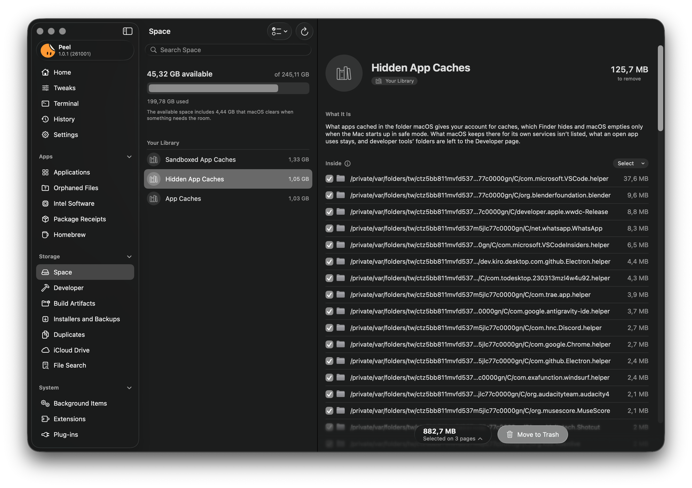
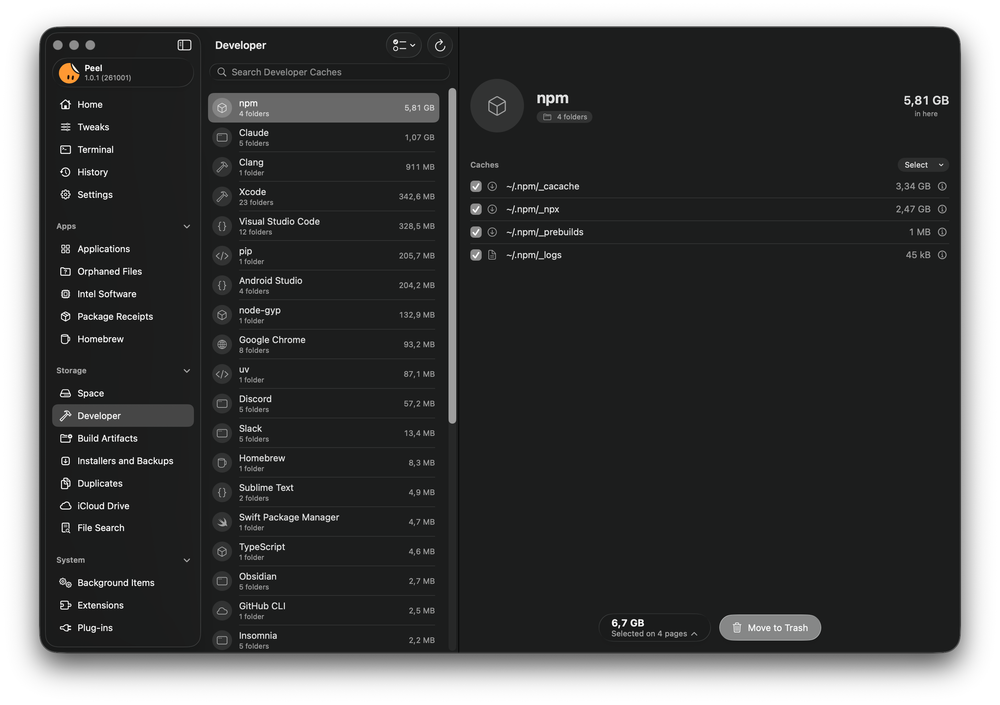
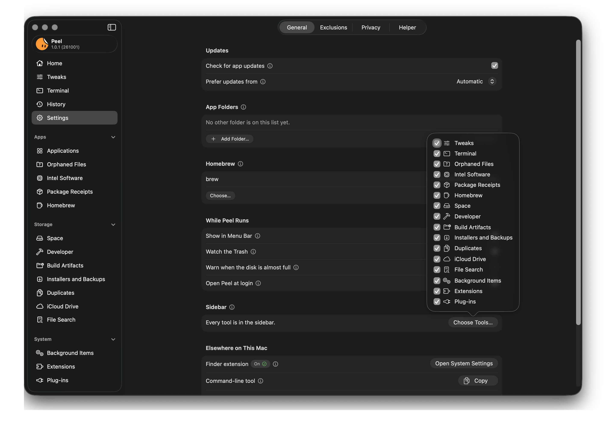

# Using Peel

What each tool in Peel does, what Peel asks for and why, and how to remove it. [README.md](README.md) says what Peel is
and how to get it, [SAFETY.md](SAFETY.md) what it protects, [PRIVACY.md](PRIVACY.md) what it sends, and
[TERMINAL.md](TERMINAL.md) every Terminal theme and setting.

## Uninstall apps completely

<p align="center">
  
</p>

- **Every leftover, with a reason.** Peel searches the places apps keep files: Application Support, caches,
  containers and group containers, preferences, saved state, logs, launch agents and daemons, plug-in folders, and
  more. Each file comes with the reason it matched, such as the app's bundle identifier, its signing team, or a
  Homebrew cask that names it.
- **What Peel is sure of, or nearly, is selected.** Files Peel matched by the app's identifier, its name, or its
  installer's receipt are selected for you. So is the folder Homebrew keeps for an app it installed, so that
  Homebrew stops listing the app once it is gone.
- **What may exist nowhere else is left to you.** A folder holding a crypto wallet, a signing key, a password
  database, or a repository is shown with its reason and not selected, and so is a place where an app keeps what
  may exist only on this Mac, such as local mail, message history, sign-in codes, or VPN connections.
- **Shared or guessed, never selected.** A file another installed app also uses is shown but never selected. What
  Peel only guesses at, from the start of a name or an identifier the app's maker or signing team also uses, waits
  under Review Before Removing.
- **The Select menu** has Select Recommended, Select All, and Deselect All. Select All selects everything you can
  select, what Peel holds back included, and asks first when that takes anything Peel doesn't recommend.
- **Several ways in.** Choose an app in the list, drop one on Peel's Dock icon, select several apps at once, or
  Control-click an app in Finder and choose Uninstall with Peel, once the Finder extension is on in System
  Settings. With Watch the Trash on, Peel notices when you drag an app to the Trash yourself and offers to clear
  what it left behind, while Peel is open or in the menu bar, and once it has Full Disk Access. Apps you keep
  outside the Applications folders, such as on another disk, join the list once you add their folder in Settings >
  General > App Folders.
- **Reset instead of remove.** Clear an app's settings without uninstalling it. Peel saves them first, so you can
  put them back, and never selects your own work.
- **Privacy permissions too, if you want.** Peel can also reset the permissions macOS gave the app, such as access
  to the camera and the microphone. History can't undo this: the app asks again for each one.
- **Its Dock icon too.** Peel takes the app's icon out of the Dock, where it would stay as a question mark,
  unless you deselect it, and History puts it back where it was when you put the app back.
- **What it opens.** An app's page lists the kinds of files and links it opens by default, and what would open
  them once it's gone. Peel never changes that itself.
- **Updates for your apps.** Peel checks your apps for new versions, through the update feed each app names, the
  App Store for apps bought there, or Homebrew for apps it installed, as Prefer updates from in Settings > General
  chooses, and shows what is new in the version that waits, as the app's own notes say it, even with no
  connection. Skip This Version and Never Check This App keep it quiet about the ones you want left alone.

## Free up disk space

<p align="center">
  
</p>

Space shows what fills your disk, area by area, and what each area is.

- **Orphaned Files:** files left behind by apps you already removed.
- **Developer:** caches of developer tools, editors, browsers, and AI models. Nothing is selected for you, and Select
  Recommended passes by what you may want again; toolchains or anything holding an account are never listed.
- **Build Artifacts:** what builds left in your projects, like `node_modules`, `DerivedData`, or `target`, each only
  when its tool's own file proves it. Nothing is selected for you, and Select Recommended passes by a project
  changed in the last 7 days.
- **Duplicates:** files and whole folders with identical contents, compared with SHA-256. One copy is always kept.
  Files under 100 KB, and folders holding less, are left out unless you choose a smaller size, in the app and in
  `peel duplicates` alike.
- **Installers and Backups:** disk images and packages in Downloads, Desktop, Documents, Public, and Shared, and in
  the folders directly inside them, where installers are usually left, with archives there that hold an app or an
  installer. It also lists packages an app keeps in Application Support, macOS installers, device firmware,
  downloads a browser never finished, and updates apps downloaded and keep until they install them. Your iPhone and
  iPad backups are listed with their size, and never moved. Nothing is selected for you, and Select Recommended
  takes only what you can download again: an installed app's installer, or one in Downloads, never an encrypted disk
  image. A disk image can also be one you made to keep files in, so look before you select it.
- **iCloud Drive:** files already safe in iCloud that are also downloaded to this Mac. Remove Downloads, as in
  Finder, takes away only the copy on this Mac: each file stays in iCloud and downloads again when you open it.
- **Space:** what's taking up room, and which app it belongs to. What an app manages itself, such as Docker's disk,
  Space leaves to that app, with the command that frees it, when there is one, for you to copy.
- **File Search:** large or old files, found through Spotlight.

<details>
<summary>Developer, Build Artifacts, and Space, in detail</summary>

<br>

**Developer:** the caches of Xcode, package managers, build systems, editors, cloud and virtual machine tools, game
engines, and AI models. It also lists the graphics caches of Chrome, Chromium, Brave, and Opera, the web caches of
apps built on Electron, such as Slack or Discord, and the browser profiles a Playwright run left in the temporary
folder when it ended early. It never lists what a browser or an app keeps for you, a profile a browser still has
open, a toolchain, or anything holding an account.

Some of what it lists you may want again, so Select Recommended passes it by: Xcode's archives and the symbols it
copied from your devices, model weights, installed packages, what a tool keeps for you to install again (Vagrant
boxes, Asset Store packages, Godot's export templates), an editor's saved state for a project that no longer
exists, and a cache with a wallet, a signing key, or a password database inside. Nothing is selected for you.

**Build Artifacts:** what builds left in the folders you choose, like `node_modules`, `DerivedData`, `target`,
`.nuxt`, `__pycache__`, Unity's `Library`, and any folder its tool tagged as a cache (`CACHEDIR.TAG`), each only
when a file of the tool that makes it proves it. Nothing is selected for you, and Select Recommended passes by a
project changed in the last 7 days, installed packages (a Python environment, `vendor`, Terraform's `.terraform`),
and a folder like `target` whose name says nothing on its own. Until you choose a folder, Peel offers `~/Developer`,
`~/Projects`, `~/Code`, or `~/src` when you have one, and adds it only when you say so.

**Space:** what's taking up room, and which app it belongs to. What an app manages itself, such as Xcode's
simulators, Docker's disk, Rust's toolchains, or Android's NDK versions, Space measures and leaves to that tool,
with the command that frees it, when there is one, for you to copy into Terminal: Peel never runs it, since it
deletes for good. In the Library at the top of the disk, Space also lists the caches and logs apps keep for every
account, and the crash reports macOS keeps. Those an administrator owns go through Peel's helper, and what macOS
keeps there for its own services is never listed. Nothing is selected for you: Select Recommended takes what Peel
could measure in an area and nothing holds back. Peel can also warn you, with a notification that opens Space, when
less than a tenth of your disk is available: turn it on in Settings > General.

</details>

<p align="center">
  
</p>

Developer shows what each of your developer tools keeps, folder by folder.

What you select on these pages, iCloud Drive aside, stays selected while you look at the others, and Move to Trash
on any of them moves it all at once, as one entry in History. Only the pages you have opened count, so nothing Peel
selected on a page you never saw goes with it. The bar at the foot of the page says how many pages that is, and
lists them.

## Look after your Mac

<p align="center">
  
</p>

> [!TIP]
> Not sure what something means? Click the ⓘ next to its name, like the one open above beside Scan for
> Vulnerabilities, for a short explanation in plain words. Next to a file, it tells you why Peel thinks the file
> belongs to the app.

- **Background Items:** launch agents and daemons, and the app that added each one.
- **Extensions:** app extensions and system extensions, and the app each one came with.
- **Plug-ins:** plug-ins of every kind, from audio units to Quick Look.
- **Package Receipts:** what installer packages put on your Mac, item by item.
- **Intel Software:** what still needs Rosetta: apps, the helpers and tools inside universal apps, plug-ins,
  drivers, background items, and the commands in `/usr/local`.
- **Homebrew:** your formulae and casks, with Update, Clean Up (and two deeper ones: downloads older than 30 days,
  or every download), Repair Taps, Check Health, Scan for Vulnerabilities, Upgrade, and Uninstall, or the command to
  run in Terminal for a cask that asks for an administrator's password. Uninstall and the clean ups delete for good,
  as Homebrew does, and Peel says so before you confirm them. A cask whose app is already gone, which Homebrew still
  lists and can't upgrade, is listed apart with Forget, which moves Homebrew's record of it to the Trash so Homebrew
  stops listing it, and History can put it back.

## Fine-tune your Mac

<p align="center">
  
</p>

Small tricks that make everyday life on a Mac a little easier. Tweaks gathers 40 settings macOS already has,
many of them out of sight, in six groups: Dock, Screenshots, Finder, Typing, Windows, and Privacy. Make a
hidden Dock appear at once, save screenshots where you want them and without the floating thumbnail, show
hidden files and every file extension in Finder, keep straight quotes as you type, drag a window from anywhere
in it, or put seconds on the menu bar clock. Each tweak says what it changes, and turning it off puts back what
was there before, or leaves it to macOS.

## Set up Terminal

<p align="center">
  
  
</p>

Peel comes with 29 dark themes for Terminal, built on Apple's own Clear Dark. Choose one, and Terminal opens with it
in every new window; Put Back gives Terminal the profile it used before. The same page can leave out the "Last
login" line, keep Terminal from reopening its windows, make Option the Meta key, silence the bell, and show the line
that stops the shell from saving its sessions.

It sets up the command line as well:

- **A prompt** you put together, with a preview, or the one macOS sets.
- **Settings zsh, Git, and ssh already have**, each with a switch: a longer history shared between windows, Up and
  Down that find what you started typing, Tab completion with a menu, rebase when pulling, and connections that stay
  alive.
- **Nothing written into your own files.** Peel writes the zsh and ssh settings to files of its own, which zsh reads
  through one line you add and ssh through two, and changes Git's with `git config`. Turning a Git setting off puts
  back what you had before Peel set it, and one you set yourself goes back to Git's default. Turn All Off undoes
  what Peel set on each tab, and on the Git tab also what you set yourself.
- **Tools** suggests command-line tools worth having, with the Homebrew command and the lines to add.

[TERMINAL.md](TERMINAL.md) shows every theme and every setting, with what each one writes.

## Stay in control

<p align="center">
  
</p>

- **History:** everything Peel moved to the Trash, ready to put back, from the app and from Terminal alike, and
  what it was asked to move and wouldn't, with the reason for each item.
- **Exclusions:** files, folders, and apps Peel must never touch. An excluded app still appears in Applications, but
  Peel won't offer to remove or reset it, and leaves out of every page the folders named with its identifier, such as
  its caches; to keep its other files, such as plug-ins or a folder named after it, exclude them too.

## Work your way

<p align="center">
  
</p>

Settings > General holds Peel's choices, among them which tools the sidebar shows.

- **Export:** what's installed and where each app came from, as JSON, a spreadsheet, plain text, or, while Homebrew is
  installed, a Brewfile.
- **Shortcuts:** actions that open a page in Peel for you to look at. None of them removes anything.
- **Sidebar:** turn off the tools you don't use in Settings, and they leave the sidebar. The View menu and
  Shortcuts still open them. Home, Applications, and History always stay. Background Items, Extensions, Plug-ins,
  Build Artifacts, Intel Software, and Terminal start turned off, and Homebrew starts on only when Homebrew is
  installed; what you turn on or off stays so.
- **The `peel` command:** most of the above, from Terminal.

With Show in Menu Bar on, Peel's menu bar item lists what each tool found the last time it looked, a line per tool
that opens it in Peel. It never adds them up into one figure and never selects anything for you.

## The `peel` command

- **It asks first.** Every command that moves something shows its plan and asks before it moves anything.
  `--dry-run` only shows the plan, and `-y` skips the question.
- **Only when you can answer.** It asks only in a terminal where you can see the plan and type, so with its output
  sent to a file or a pipe it needs `-y`. It ignores keys typed before the question appeared, and answering no
  exits with code 2, so `peel uninstall Foo && next-step` stops there.
- **What the app would do.** It moves only what the app would suggest, or a group of orphaned files you name with
  `peel orphans --remove`, through the same checks and into the same History. Anything that needs an administrator
  is left to the app, and the command won't run under `sudo`.
- **For scripts.** Most commands take `--json`, which lists without moving, and `peel uninstall --json` reports what
  moved, what stayed, and why.
- **Completions and manual.** A Homebrew install sets up its completions for zsh, bash, and fish, and its manual
  page, `man peel`. Otherwise `peel --generate-completion-script zsh` (or `bash`, or `fish`) writes the
  completions for your shell.

## What Peel asks for, and why

<p align="center">
  
</p>

Peel opens without any of these and does more with each one. Home, in the picture above, shows which ones are on
and takes you straight to the right place in System Settings.

| Permission | What it lets Peel do |
|---|---|
| Full Disk Access | Look inside the Trash and the private folders where apps keep their data. Without it, Peel can't find everything an app leaves behind. |
| App Management | Move another developer's app to the Trash. Without it, Peel can still clear an app's files, but macOS may refuse to move the app itself. |
| Helper | Move the leftovers that sit in folders only an administrator can change, and put them back, and start, stop, enable, or disable other developers' background items that run as root. It answers administrators only. macOS asks you to approve it once in Login Items & Extensions, and an update of Peel brings its new helper with it. |
| Notifications (optional) | Tell you when your apps have updates, when Homebrew finishes an upgrade or runs into a problem, when your disk is almost full if you turn that warning on, and, with Watch the Trash on, when you move an app to the Trash yourself. |
| Folders macOS asks about | Without Full Disk Access, macOS asks the first time Peel looks in Desktop, Documents, or Downloads for installers, duplicates, and what builds left, inside another app's data for what it would leave behind, or at your cloud folders to measure them. |
| Finder extension (optional) | Add Uninstall with Peel to the menu you get when you Control-click an app in Finder. |
| Open at Login (optional) | Start Peel when you log in. With Show in Menu Bar on, it keeps running after you close its window, so Watch the Trash keeps working. |

## Languages

Peel is in English and translated into 17 languages: Romanian, German, French, Spanish, Portuguese (Brazilian),
Italian, Japanese, Chinese (Simplified), Chinese (Traditional), Dutch, Korean, Russian, Polish, Turkish, Swedish,
Czech, and Ukrainian. It uses the first language in your Mac's list that it speaks, and English for any other. Each
translation uses the words macOS itself uses in that language.

To use Peel in a language other than your Mac's, open System Settings > General > Language & Region, click the Add
button under Applications, and choose Peel and a language. The `peel` command stays in English, since scripts read
it.

## Uninstall Peel

In Settings > General, choose Remove Peel. Peel then:

- moves the link to the `peel` command to the Trash, if you made one in Settings, through its helper when only an
  administrator can, and has the helper move its own record of what it moved;
- removes its helper and its login item;
- moves itself, the files that are certainly its own, and its folder in Application Support to the Trash, all but
  the Terminal settings zsh and ssh read. That folder holds History, your exclusions, and the settings Peel saved
  when you reset an app;
- takes its icon out of the Dock, clears its settings, and quits.

What Peel changed for you stays as it is: tweaks, Terminal's theme and its options, the shell and ssh settings,
`~/.hushlogin`, Git's settings, the build folders you left out of Time Machine, and the background items you
disabled. Peel leaves the shell and ssh settings in its folder, in `Terminal`, where the line you added to
`~/.zshrc` and the two at the end of `~/.ssh/config` read them. Turn these off first if you want them gone, or
afterwards delete those lines and that folder.

If you installed Peel with Homebrew, Settings shows this command in its place, with a button that copies it. Run it
in Terminal: Homebrew takes Peel off its list of what is installed, deletes the app rather than moving it to the
Trash, and moves Peel's files to the Trash.

```bash
brew uninstall --zap --cask peel
```

When only an administrator can remove the link to the `peel` command you made in Settings, and Peel's helper isn't
installed, Remove Peel leaves the link, and Settings says so beforehand. `brew uninstall` removes only the link
Homebrew made. Remove a link that stays yourself:

```bash
sudo rm -f /usr/local/bin/peel
```

## Questions

### Why does Peel show a smaller size than Finder?

Peel shows what moving an item to the Trash would free, and Finder shows the space it takes. The two differ when
files share their space: a copy Finder makes on an APFS disk shares its blocks with the original until one of them
changes, and a file can have a second name somewhere else, which keeps it. Peel counts only what would really go.

### Why does Peel ask for Full Disk Access?

macOS keeps other apps' data, and the Trash, out of sight of any app without it. Peel works without it, but can't
see everything an app leaves behind. [PRIVACY.md](PRIVACY.md) lists the only times Peel goes online.

### Is Peel really free?

Yes. Peel is free and open source under the GNU General Public License, with no paid edition, no ads, and no
account.

### Something in Peel isn't clear. Where can I read more?

Click the ⓘ next to its name. If it's still not clear,
[open an issue](https://github.com/TuguiDragos/Peel/issues/new/choose): wording that leaves you guessing is a bug
too.
