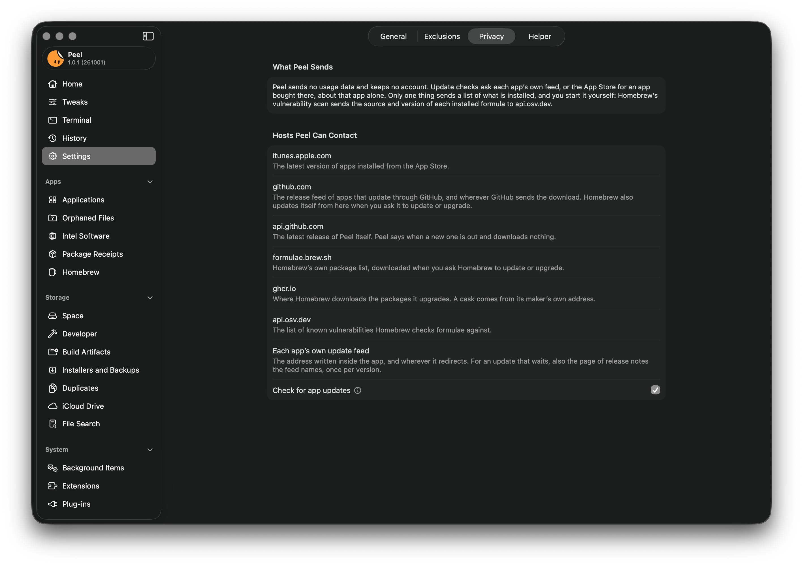

# Privacy

  

Settings > Privacy shows what Peel sends and every address it or Homebrew may contact.

Peel sends no analytics and has no account. On its own, it goes online only to check your apps for updates, and you can
turn that off.

Each check asks one app's own update feed about that app alone, or the App Store about an app bought there, and says
only that Peel is asking, with the country of your Mac's region for the App Store, whose answer depends on it: not which
version, not your macOS, and not your languages. Every check uses https, and a feed that sends it elsewhere is followed
only to another https address. Each check asks about one app, but taken together, the checks show the App Store which of
its apps you have, and GitHub which of your apps update through it.

For an update that waits, Peel also reads the page of release notes the app's feed names, and the app's own feed when
Homebrew found the update, once per version, and keeps the notes so they show with no connection. When the feed names
a page of notes for each language, Peel asks for the one in your language, so the server that keeps those pages can
tell which language you read. Nothing in them is loaded or run: Peel shows their text, and a link in them opens only
when you click it.

Homebrew goes online only when you ask it to update, upgrade, repair its taps, which asks each tap's repository whether
its main branch was renamed, or scan for vulnerabilities, and that scan is the one time Peel sends a list of what is
installed all at once: for each Homebrew formula it checks, where its code comes from (the address of its source
repository and the release tag, or a package's name) and its version, sent to `api.osv.dev`. Your own Homebrew settings
(a `brew.env` file) can change that, and the Homebrew page then says what they change.

Turn off Check for app updates in Settings, and Peel contacts nothing on its own; the `peel updates` command still
checks whenever you run it, whatever that switch says.

Report an Issue, in the Help menu, opens GitHub's form for a new issue with Peel's version, your macOS version, and
whether your Mac has Apple silicon or Intel already filled in. They are in the address the browser opens, so GitHub sees
them as the page loads, and they are posted only if you send the issue.

## Every address Peel or Homebrew may contact

| Address | Why |
|---|---|
| `itunes.apple.com` | The latest version of an app bought from the App Store. No other app is ever asked about. |
| `github.com` | Release feeds of apps that update through GitHub, and wherever GitHub sends the download. Homebrew also updates itself and its taps from here when you ask it to, Repair Taps included. |
| `api.github.com` | The latest release of Peel itself. Peel says when a new one is out and downloads nothing. |
| `formulae.brew.sh` | Homebrew's list of packages, when you ask Homebrew to update or upgrade. |
| `ghcr.io` | Where Homebrew downloads the packages it upgrades. A cask comes from its maker's own address. |
| `api.osv.dev` | The database of known vulnerabilities that Homebrew's scan checks your formulae against. |
| Each app's own update feed | The address written inside the app, such as a Sparkle feed, and wherever it redirects. For an update that waits, also the page of release notes the feed names, once per version. |
