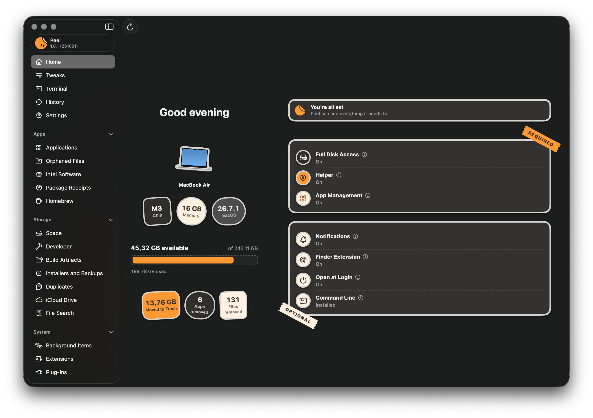
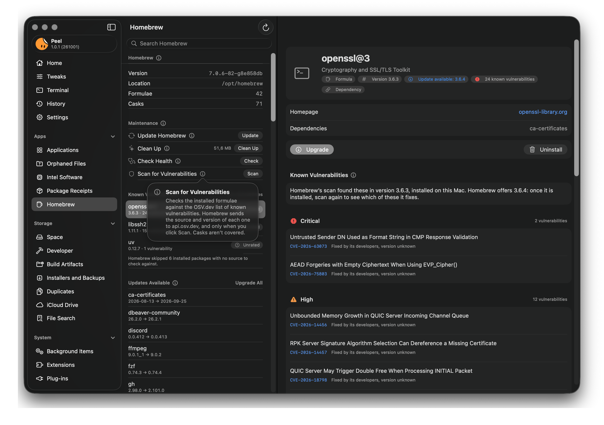
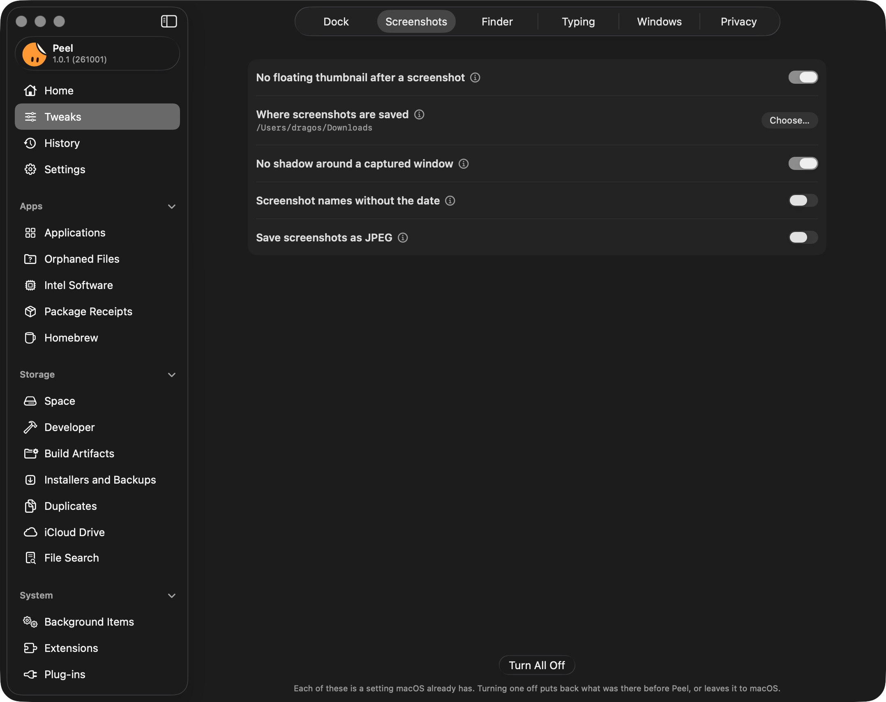
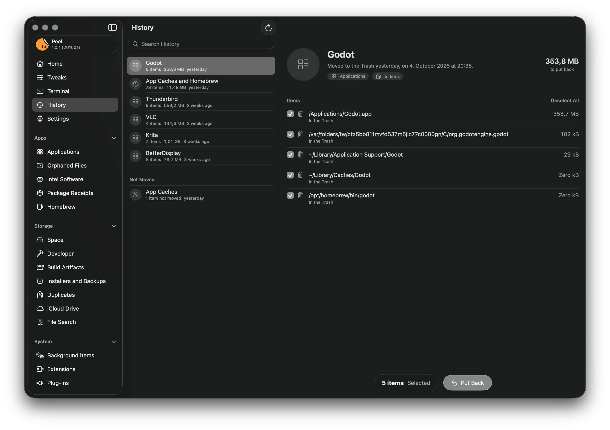

<p align="center">
  <a href="https://tuguidragos.com"></a>
  <a href="https://www.linkedin.com/in/tuguidragos/"></a>
  <a href="https://www.instagram.com/tuguidragos/"></a>
  <a href="https://n8n.io/creators/tuguidragos/"></a>
  <a href="https://www.credly.com/users/tuguidragos"></a>
</p>

<p align="center">
  
</p>

<h1 align="center">Peel</h1>

<p align="center">
  <strong>Uninstall Mac apps completely, and see why every file belongs to them.</strong><br>
  A free, open source app uninstaller and cleaner for macOS.
</p>

<p align="center">
  <a href="https://github.com/TuguiDragos/Peel/releases/latest"></a>
  
  
  <a href="LICENSE"></a>
</p>

## Install

> [!CAUTION]
> Peel is published in one place only: this repository,
> [github.com/TuguiDragos/Peel](https://github.com/TuguiDragos/Peel). Download it from its
> [releases](https://github.com/TuguiDragos/Peel/releases/latest) or with the Homebrew command below, which installs
> the same release. My only website is [tuguidragos.com](https://tuguidragos.com). Any other site, download page, or
> store offering Peel is not mine, and what it gives you may not be the app I build and sign. Peel is free, so anyone
> asking you to pay for it is not me. Please download it only from here.

**Requirements:** macOS Tahoe 26 or later, on a Mac with Apple silicon or an Intel processor. Peel moves your
files, so I test every release myself before it ships, and I can't test it on an older macOS. It never runs where
it hasn't been tested, which is why it starts at macOS 26.

### Download

1. Download `Peel-<version>.dmg` from the [latest release](https://github.com/TuguiDragos/Peel/releases/latest).
2. Open it and drag Peel into your Applications folder.
3. Open Peel. It's signed by its developer and notarized by Apple, so it opens like any app you download from
   the web.

### Homebrew

```bash
brew install --cask tuguidragos/tap/peel
```

Homebrew also puts the `peel` command on your path.

To update Peel, download the new release and replace the copy in your Applications folder, or run
`brew upgrade --cask peel`.

## Why Peel

<p align="center">
  
</p>

Dragging an app to the Trash leaves pieces of it behind: caches, settings, containers, launch agents, and support
files scattered across your Library, sometimes gigabytes of them. Peel finds what an app left, tells you why each
file belongs to it and how sure it is, and moves what you choose to the Trash. Nothing is deleted, and History can
put all of it back.

With Show in Menu Bar on, Peel's menu bar item lists what each tool found the last time it looked, a line per tool
that opens it in Peel. It never adds them up into one figure and never selects anything for you.

Peel is free and open source, and it speaks English and 17 other languages.

## What Peel does

### Uninstall apps completely

<p align="center">
  
</p>

- **Every leftover, with a reason.** Peel searches the places apps keep files: Application Support, caches,
  containers and group containers, preferences, saved state, logs, launch agents and daemons, plug-in folders, and
  more. Each file comes with the reason it matched, such as the app's bundle identifier, its signing team, or a
  Homebrew cask that names it.
- **Only the sure things are selected.** Files that certainly belong to the app are selected for you, unless
  Peel sees something inside that may exist nowhere else, such as a crypto wallet, a signing key, or a
  repository. A file another installed app also uses is shown but never selected, and anything Peel is less sure
  of waits under Review Before Removing. A list's Select menu picks what Peel recommends, everything, or nothing,
  and asks before it selects what Peel doesn't recommend.
- **Several ways in.** Choose an app in the list, drop one on Peel's Dock icon, select several apps at once, or
  Control-click an app in Finder and choose Uninstall with Peel. With Watch the Trash on, Peel notices when you
  drag an app to the Trash yourself and offers to clear what it left behind. Apps you keep outside the Applications
  folders, such as on another disk, join the list once you add their folder in Settings > General > App Folders.
- **Reset instead of remove.** Clear an app's settings without uninstalling it. Peel saves them first, so you can
  put them back, and never selects your own work.
- **Privacy permissions too, if you want.** Peel can also reset the permissions macOS gave the app, such as access
  to the camera and the microphone.
- **Its Dock icon too, if you want.** Peel can take the app's icon out of the Dock, where it would stay as a
  question mark, and History puts it back where it was when you put the app back.
- **What it opens.** An app's page lists the kinds of files and links it opens by default, and what would open
  them once it's gone. Peel never changes that itself.
- **Updates for your apps.** Peel checks your apps for new versions, through the update feed each app names or the
  App Store for apps bought there, and shows what is new in the version that waits, as the app's own notes say it,
  with no connection too. Skip This Version and Never Check This App keep it quiet about the ones you want left
  alone.

### Free up disk space

- **Orphaned Files:** files left behind by apps you already removed.
- **Developer:** caches of Xcode, package managers, build systems, editors, cloud and virtual machine tools, game
  engines, and AI models, the graphics caches of Chrome, Chromium, Brave, and Opera, and the web caches of apps built
  on Electron, such as Slack or Discord (never what a browser or an app keeps for you), and the browser profiles a
  Playwright run left in the temporary folder when it ended early, never one a browser still has open. Xcode's
  archives and the symbols it copied from your devices, model weights, installed packages, and what a tool keeps for
  you to install again (Vagrant boxes, Asset Store packages, Godot's export templates) are listed but never selected
  for you, and toolchains or anything holding an account are never listed.
- **Build Artifacts:** what builds left in the folders you choose, like `node_modules`, `DerivedData`, `target`,
  `.nuxt`, `__pycache__`, Unity's `Library`, and any folder its tool tagged as a cache (`CACHEDIR.TAG`), each only
  when a file of the tool that makes it proves it. A project changed in the last 7 days is never selected for you, and
  neither are installed packages (a Python environment, `vendor`, Terraform's `.terraform`) or a folder like `target`
  whose name says nothing on its own. Until you choose a folder, Peel offers `~/Developer`, `~/Projects`, `~/Code`,
  or `~/src` when you have one, and adds it only when you say so.
- **Duplicates:** files and whole folders with identical contents, compared with SHA-256. One copy is always kept.
  Files under 100 KB, and folders holding less, are left out unless you choose a smaller size, in the app and in
  `peel duplicates` alike.
- **Installers and Backups:** installers of apps you already have, including packages an app keeps in Application
  Support, macOS installers, device firmware, downloads a browser never finished, updates apps downloaded and keep
  until they install them, and what your iPhone backups hold. Nothing is selected for you.
- **iCloud Drive:** files already safe in iCloud that are also downloaded to this Mac. Remove Downloads, as in
  Finder, takes away only the copy on this Mac: each file stays in iCloud and downloads again when you open it.
- **Space:** what's taking up room, and which app it belongs to. What an app manages itself, such as Xcode's
  simulators or Docker's disk, Space measures and leaves to that app, with the command that frees it for you to copy
  into Terminal: Peel never runs it, since it deletes for good. The caches and logs apps keep for every account,
  and the crash reports macOS keeps, in the Library at the top of the disk, go through Peel's helper when an
  administrator owns them, and what macOS keeps there for its own services is never listed. Peel can also warn you,
  with a notification that opens Space, when less than a tenth of your disk is available: turn it on in Settings >
  General.
- **File Search:** large or old files, found through Spotlight.

What you select on these pages, iCloud Drive aside, stays selected while you look at the others, and Move to Trash
on any of them moves it all at once, as one entry in History. Only the pages you have opened count, so nothing Peel
selected on a page you never saw goes with it. The bar at the foot of the page says how many pages that is, and
lists them.

### Look after your Mac

<p align="center">
  
</p>

> [!TIP]
> Not sure what something means? Click the ⓘ next to its name, like the one open above beside Updates Available,
> for a short explanation in plain words. Next to a file, it tells you why Peel thinks the file belongs to the app.

- **Background Items:** launch agents and daemons, and the app that added each one.
- **Extensions and Plug-ins:** app extensions, system extensions, and plug-ins, from audio units to Quick Look.
- **Package Receipts:** what installer packages put on your Mac, item by item.
- **Intel Software:** what still needs Rosetta: apps, the helpers and tools inside universal apps, plug-ins,
  drivers, background items, and the commands in `/usr/local`.
- **Homebrew:** your formulae and casks, with Update, Clean Up, Check Health, Scan for Vulnerabilities, Upgrade,
  and Uninstall, or the command to run in Terminal for a cask that asks for an administrator's password.

### Fine-tune your Mac

<p align="center">
  
</p>

Small tricks that make everyday life on a Mac a little easier. Tweaks gathers 39 settings macOS already has but
keeps out of sight, in six groups: Dock, Screenshots, Finder, Typing, Windows, and Privacy. Make a hidden Dock
appear at once, save screenshots where you want them and without the floating thumbnail, show hidden files and
every file extension in Finder, keep straight quotes as you type, drag a window from anywhere in it, or put
seconds on the menu bar clock. Each tweak says what it changes, and turning it off puts back what was there
before, or leaves it to macOS.

### Set up Terminal

<p align="center">
  
  
</p>

Peel comes with 29 dark themes for Terminal, built on Apple's own Clear Dark. Choose one, and Terminal opens with it
in every new window; Put Back gives Terminal its own profile again. The same page can leave out the "Last login"
line, make Option the Meta key, and silence the bell.

It sets up the command line as well. Choose a prompt, or keep the one macOS sets, and turn on settings zsh, Git, and
ssh already have, each with a switch: a longer history shared between windows, Up and Down that find what you started
typing, Tab completion with a menu, rebase when pulling, and connections that stay alive. Peel writes them to files of
its own, which zsh and ssh read through a line you add, and changes Git's with `git config`, so Turn All Off puts
everything back. The Tools tab suggests command-line tools worth having, with the Homebrew command and the lines to
add. [TERMINAL.md](TERMINAL.md) shows every theme and every setting, with what each one writes.

### Stay in control

- **History:** everything Peel moved to the Trash, ready to put back, from the app and from Terminal alike, and
  what it was asked to move and wouldn't, with the reason for each item.
- **Exclusions:** files, folders, and apps Peel must never touch.

### Work your way

- **Export:** what's installed and where each app came from, as JSON, a spreadsheet, plain text, or a Brewfile.
- **Shortcuts:** actions that open a page in Peel for you to look at. None of them removes anything.
- **Sidebar:** turn off the tools you don't use in Settings, and they leave the sidebar. The View menu and
  Shortcuts still open them.
- **The `peel` command:** most of the above, from Terminal.

## Safe by design

<p align="center">
  
</p>

A cleaner should never cost you something you wanted. Peel is built around that.

- **The Trash, never deletion.** Everything Peel removes goes to the Trash, and History puts it back where it was.
  Three things can't be undone that way, and Peel says so before you confirm them: Homebrew's own uninstall and
  cleanup, and resetting an app's privacy permissions.
- **Protected places stay protected.** Peel refuses to move iCloud Drive, keychains, your SSH and signing keys, the
  keys of crypto wallets, Mail, Messages, Safari, Contacts, Calendars, Notes, photo and music libraries, iPhone and
  iPad backups, and the Desktop, Documents, and Downloads folders themselves. No selection can override it.
- **Crypto wallets are never selected for you.** Beyond the places wallets keep their keys, a browser profile with
  a wallet extension such as MetaMask stays where it is, so uninstalling a browser never takes a wallet with it.
  A folder an uninstall or Orphaned Files finds a wallet or a signing key in is shown with that reason and moves
  only if you select it yourself. [SAFETY.md](SAFETY.md#crypto-wallets) says how Peel knows one.
- **Checked again at the last moment.** Peel looks at each item once more right before it moves, so something
  swapped in the meantime stays where it is.
- **Nothing shared, nothing unknown.** A file another app also uses is never selected for you. A folder Peel
  couldn't measure or read is shown as unknown, never as empty, and never selected for you either.
- **Your exclusions, everywhere.** What you exclude never appears in any list, and a folder holding something you
  excluded is never moved.
- **Every decision explained.** When Peel holds a file back, the row says why.

[SAFETY.md](SAFETY.md) lists everything Peel protects, and [ARCHITECTURE.md](ARCHITECTURE.md) shows how a
removal travels through the code.

## What Peel asks for, and why

Peel opens without any of these and does more with each one. Home, the first picture on this page, shows which ones
are on and takes you straight to the right place in System Settings.

| Permission | What it lets Peel do |
|---|---|
| Full Disk Access | Look inside the Trash and the private folders where apps keep their data. Without it, Peel can't find everything an app leaves behind. |
| App Management | Move another developer's app to the Trash. Without it, Peel can still clear an app's files, but macOS may refuse to move the app itself. |
| Helper | Move the leftovers that sit in folders only an administrator can change, and start or stop other developers' background items that run as root. macOS asks you to approve it once, in Login Items & Extensions. |
| Notifications (optional) | Tell you when your apps have updates, when your disk is almost full if you turn that warning on, and, with Watch the Trash on, when you move an app to the Trash yourself. |
| Finder extension (optional) | Add Uninstall with Peel to the menu you get when you Control-click an app in Finder. |
| Open at Login (optional) | Start Peel when you log in. With Show in Menu Bar on, it keeps running after you close its window, so Watch the Trash keeps working. |

## Languages

Peel is in English and translated into 17 languages: Romanian, German, French, Spanish, Portuguese (Brazilian),
Italian, Japanese, Chinese (Simplified), Chinese (Traditional), Dutch, Korean, Russian, Polish, Turkish, Swedish,
Czech, and Ukrainian. It uses the first language in your Mac's list that it speaks, and English for any other. Each
translation uses the words macOS itself uses in that language.

To use Peel in a language other than your Mac's, open System Settings > General > Language & Region, click the Add
button under Applications, and choose Peel and a language. The `peel` command stays in English, since scripts read
it.

## Privacy

Peel sends no analytics and has no account. On its own, it goes online only to check your apps for updates, and you
can turn that off. Each check asks one app's own update feed about that app alone, or the App Store about an app
bought there, and says only that Peel is asking: not which version, not your macOS, and not your languages. For an
update that waits, Peel also reads the page of release notes the app's feed names, and the app's own feed when Homebrew
found the update, once per version, and keeps the notes so they show with no connection. Nothing in them is loaded or
run: Peel shows their text, and a link in them opens only when you click it. Every check uses https, and a feed that
sends it elsewhere is followed only to another https address. Homebrew goes online
only when you ask it to update, upgrade, or scan for vulnerabilities, and that scan is the one time a list of what is
installed leaves your Mac: for each Homebrew formula it checks, where its code comes from (the address of its source
repository and the release tag, or a package's name) and its version, sent to `api.osv.dev`. Your own Homebrew
settings (a `brew.env` file) can change that, and the Homebrew page then says what they change. Turn off Check for app
updates in Settings, and Peel contacts nothing on its own.

<details>
<summary>Every address Peel or Homebrew may contact</summary>

<br>

Settings > Privacy lists the same places.

| Address | Why |
|---|---|
| `itunes.apple.com` | The latest version of an app bought from the App Store. No other app is ever asked about. |
| `github.com` | Release feeds of apps that update through GitHub, and wherever GitHub sends the download. Homebrew also updates itself from here when you ask it to. |
| `api.github.com` | The latest release of Peel itself. Peel says when a new one is out and downloads nothing. |
| `formulae.brew.sh` | Homebrew's list of packages, when you ask Homebrew to update or upgrade. |
| `ghcr.io` | Where Homebrew downloads the packages it upgrades. A cask comes from its maker's own address. |
| `api.osv.dev` | The database of known vulnerabilities that Homebrew's scan checks your formulae against. |
| Each app's own update feed | The address written inside the app, such as a Sparkle feed, and wherever it redirects. For an update that waits, also the page of release notes the feed names, once per version. |

</details>

## The `peel` command

The command ships inside the app. Settings > General shows the Terminal command that puts it on your path, and a
Homebrew install puts it there for you.

Every command that moves something asks first, and takes `--dry-run` to only show the plan and `-y` to skip the
question. It asks only where you can see the plan and answer, so with its output sent to a file or a pipe it needs
`-y`, and it ignores keys typed before the question appeared. Answering no exits with code 2, so
`peel uninstall Foo && next-step` stops there. The command moves only what the app would suggest, through the same
checks, into the same History, and leaves anything that needs an administrator to the app. It won't run under
`sudo`. Most commands take `--json`, which lists without moving, and `peel uninstall --json` reports what moved,
what stayed, and why. A Homebrew install also sets up its completions for zsh, bash, and fish and its manual page,
`man peel`; otherwise `peel --generate-completion-script zsh` writes the completions for your shell.

<details>
<summary>All commands</summary>

<br>

| Command | What it does |
|---|---|
| `peel apps` | Lists installed apps. |
| `peel inventory` | Writes out what is installed and where each app came from, as text, JSON, CSV, or a Brewfile. |
| `peel leftovers <app>` | Shows the files an app leaves behind, and why each one belongs to it. |
| `peel uninstall <app>` | Moves an app and its leftovers to the Trash. `--reset-privacy` also clears the permissions macOS gave it. |
| `peel orphans` | Lists files left by apps that are no longer installed. `--remove <group>` moves one group. |
| `peel caches` | Lists the caches of developer tools. `--remove` moves the ones Peel suggests. |
| `peel projects <folders>` | Lists what builds left in your projects. `--remove` moves the ones Peel suggests. |
| `peel duplicates [folders]` | Finds files and folders with identical contents. `--remove` keeps one copy of each and moves the rest. |
| `peel search` | Searches Spotlight by name, kind, size, or age. |
| `peel updates` | Checks your apps for updates. |
| `peel history` | Lists what Peel moved to the Trash, from the app and from Terminal alike. `--refused` lists what it was asked to move and wouldn't, and why. |
| `peel restore <id>` | Puts one of those removals back. |
| `peel exclusions` | Shows what Peel leaves alone. `add` and `remove` change it. |

</details>

## Frequently asked questions

<details>
<summary><strong>How do I completely uninstall an app on a Mac?</strong></summary>

<br>

Open Peel, choose the app under Applications, look over what Peel found, and click Move to Trash. The app and its
leftovers go to the Trash together, and History can put them back. You can also Control-click the app in Finder
and choose Uninstall with Peel.

</details>

<details>
<summary><strong>Can Peel delete something I need?</strong></summary>

<br>

Peel moves files to the Trash instead of deleting them, and History can put any removal back. It selects only what
certainly belongs to the app, never selects a file another app uses, and refuses to touch places like iCloud Drive,
your keychains, Mail, Messages, and photo libraries.

</details>

<details>
<summary><strong>Why does Peel show a smaller size than Finder?</strong></summary>

<br>

Peel shows what moving an item to the Trash would free, and Finder shows the space it takes. The two differ when
files share their space: a copy Finder makes on an APFS disk shares its blocks with the original until one of them
changes, and a file can have a second name somewhere else, which keeps it. Peel counts only what would really go.

</details>

<details>
<summary><strong>Why does Peel ask for Full Disk Access?</strong></summary>

<br>

macOS keeps other apps' data, and the Trash, out of sight of any app without it. Peel works without it, but can't
see everything an app leaves behind. [Privacy](#privacy) lists the only times Peel goes online.

</details>

<details>
<summary><strong>Does Peel collect any data?</strong></summary>

<br>

No. Peel has no analytics and no account. It goes online only to check your apps for updates, which you can turn
off, and when you ask Homebrew to do something.

</details>

<details>
<summary><strong>Is Peel really free?</strong></summary>

<br>

Yes. Peel is free and open source under the GNU General Public License, with no paid edition, no ads, and no
account.

</details>

<details>
<summary><strong>Does Peel work on Intel Macs and older versions of macOS?</strong></summary>

<br>

Peel runs on Intel Macs and Macs with Apple silicon, on macOS Tahoe 26 or later. It doesn't run on earlier
versions of macOS: I test every release myself before it ships, and I can't test it on an older macOS, so Peel
never runs where it hasn't been tested.

</details>

<details>
<summary><strong>Something in Peel isn't clear. Where can I read more?</strong></summary>

<br>

Click the ⓘ next to its name. If it's still not clear,
[open an issue](https://github.com/TuguiDragos/Peel/issues/new/choose): wording that leaves you guessing is a bug
too.

</details>

## Uninstall Peel

In Settings > General, choose Remove Peel. It has its helper move its record of what it moved to the Trash, removes
its helper and its login item, moves itself, the files that are certainly its own, and its folder in Application
Support to the Trash, clears its settings, and quits. That
folder holds History, your exclusions, and the settings Peel saved when you reset an app.

What Peel changed for you stays as it is: tweaks, Terminal's theme, and Git's settings. Turn them off first if you
want them gone. The shell and ssh settings live in Peel's folder, so they go with it, and the line you added to
`~/.zshrc` and the two at the end of `~/.ssh/config` then do nothing. You can delete them.

If you installed Peel with Homebrew, Settings shows this command in its place, with a button that copies it. Run it
in Terminal: Homebrew takes Peel off its list of what is installed, deletes the app rather than moving it to the
Trash, and moves Peel's files to the Trash.

```bash
brew uninstall --zap --cask peel
```

If you put the `peel` command on your path from Settings, remove that link too. Homebrew removes only the one it
made.

```bash
sudo rm -f /usr/local/bin/peel
```

## Build it yourself

You need macOS Tahoe 26 or later, Xcode 27 (Swift 6.4), and a team to sign with, even a free one. Open
`Peel.xcodeproj`, choose your team for the four targets under Signing & Capabilities, and run the Peel scheme. Or,
from Terminal, with your own team ID:

```bash
xcodebuild -project Peel.xcodeproj -scheme Peel -configuration Debug -derivedDataPath build/DerivedData DEVELOPMENT_TEAM=YOUR_TEAM_ID build
swift test --package-path Packages/PeelCore
```

[ARCHITECTURE.md](ARCHITECTURE.md) explains how Peel is put together, and [CONTRIBUTING.md](CONTRIBUTING.md) what a
change needs.

## Contributing

Bug reports, ideas, and pull requests are welcome.

- Found a bug or have an idea? [Open an issue](https://github.com/TuguiDragos/Peel/issues/new/choose).
- Found a security problem? Please report it privately, as [SECURITY.md](SECURITY.md) describes, and not in a
  public issue.
- Everyone taking part is expected to follow the [Code of Conduct](CODE_OF_CONDUCT.md).

## License

Peel is free software under the [GNU General Public License, version 3 or later](LICENSE). You may use, study,
change, and share it. If you share a changed version, it has to carry the same freedoms: nobody can take Peel,
close it, and sell it as their own.

Copyright (C) 2026 [Țugui Dragoș-Constantin](https://tuguidragos.com)

Peel moves what it removes to the Trash, and History can put it back. As the GPL states, it comes with no warranty,
to the extent the law allows.

swift-argument-parser, Peel's only dependency, is by Apple Inc. under the Apache License 2.0. The motion of the
face at the head of the sidebar is ported from [blobatar](https://github.com/Alain00/blobatar), by Alain, under the
MIT License. Both licenses ship inside the app and are kept in `Peel/Licenses/`.

## More from Țugui Dragoș

<p align="center">
  <a href="https://github.com/TuguiDragos/tapetum"></a>
</p>

<h3 align="center">Tapetum</h3>

<p align="center">
  Spend your days in VS Code, or in an editor built on it? Try Tapetum, my free theme pack: 58 themes in 28
  families, each in dark and light, with every color placed by hand and its contrast measured on the surface it sits
  on.
</p>

<p align="center">
  <a href="https://marketplace.visualstudio.com/items?itemName=tuguidragos.tapetum"></a>
  <a href="https://open-vsx.org/extension/tuguidragos/tapetum"></a>
  <a href="https://github.com/TuguiDragos/tapetum"></a>
</p>
