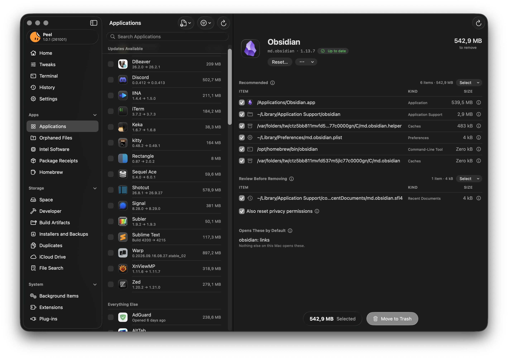

<p align="center">
  
</p>

<h1 align="center">Peel</h1>

<p align="center">
  <strong>Uninstall Mac apps completely, and see why every file belongs to them.</strong><br>
  A free, open source uninstaller and cleaner for macOS, which also fine-tunes your Mac and sets up Terminal.
</p>

<p align="center">
  <a href="https://github.com/TuguiDragos/Peel/releases/latest"></a>
  
  
  <a href="LICENSE"></a>
</p>

<p align="center">
  
</p>

## Install

> [!CAUTION]
> Peel is published in one place only: this repository,
> [github.com/TuguiDragos/Peel](https://github.com/TuguiDragos/Peel). Download it from its
> [releases](https://github.com/TuguiDragos/Peel/releases/latest) or with the Homebrew command below, which installs
> the same release. My only websites are [tuguidragos.com](https://tuguidragos.com) and Peel's page,
> [peel.tuguidragos.com](https://peel.tuguidragos.com), whose downloads lead here. Any other site, download page, or
> store offering Peel is not mine, and what it gives you may not be the app I build and sign. Peel is free, so anyone
> asking you to pay for it is not me. Please download it only from here.
>
> The Homebrew command below is the only command that installs Peel, so a website that asks you to paste anything else
> into Terminal to get Peel is not mine. Every copy I release is signed by my team, `6R6J264YA2`, and
> `codesign -dv /Applications/Peel.app 2>&1 | grep TeamIdentifier` shows it.

**Requirements:** macOS Tahoe 26 or later, on any Mac that runs it: every Mac with Apple silicon, and the few Intel
Macs from 2019 and 2020 that [Apple lists for macOS 26](https://support.apple.com/en-us/122867). Peel moves your
files, and each version of macOS moves where apps keep theirs: macOS 26, for one, gives an app's list of recent
documents a new name. So I test every release myself before it ships, on macOS 26 and every version since, which is
why it starts at macOS 26 and won't open on an older one.

### Download

1. Download `Peel-<version>.dmg` from the [latest release](https://github.com/TuguiDragos/Peel/releases/latest).
2. Open it and drag Peel into your Applications folder.
3. Open Peel. It's signed by its developer and notarized by Apple, so it opens like any app you download from
   the web.

### Homebrew

```bash
brew install --cask tuguidragos/tap/peel
```

Homebrew also puts the `peel` command on your path.

To update Peel, download the new release and replace the copy in your Applications folder, or run
`brew upgrade --cask peel`. About Peel says when a new version is out, with a Download button, or
the Homebrew command for a copy Homebrew installed, and downloads nothing itself.

## What Peel does

Dragging an app to the Trash leaves pieces of it behind: caches, settings, containers, launch agents, and support
files scattered across your Library, sometimes gigabytes of them. Peel finds what an app left, tells you why each
file belongs to it and how sure it is, and moves what you choose to the Trash. Nothing of yours is deleted without
asking first, and History puts back what went to the Trash.

- **[Uninstall apps completely](GUIDE.md#uninstall-apps-completely):** the app and every file it left, each with the
  reason it matched, and what's new in the next version of the apps you keep.
- **[Free up disk space](GUIDE.md#free-up-disk-space):** what apps you removed left behind, caches of developer tools,
  what builds left in your projects, duplicates, installers and backups, local copies of files already safe in
  iCloud, and what fills your disk.
- **[Look after your Mac](GUIDE.md#look-after-your-mac):** background items, extensions, plug-ins, installer receipts,
  software that still needs Rosetta, and Homebrew.
- **[Fine-tune your Mac](GUIDE.md#fine-tune-your-mac):** settings macOS already has, many of them out of sight, each
  with a switch of its own.
- **[Set up Terminal](GUIDE.md#set-up-terminal):** dark themes built on Apple's Clear Dark, a prompt, and settings
  zsh, Git, and ssh already have, each shown in [TERMINAL.md](TERMINAL.md).
- **[Stay in control](GUIDE.md#stay-in-control):** History puts back what Peel moved, and Exclusions name what Peel
  leaves alone.
- **[Work your way](GUIDE.md#work-your-way):** export what's installed, open a tool from Shortcuts or the menu bar,
  choose the tools the sidebar shows, and do most of it from Terminal with the `peel` command.

Peel is free and open source, and it speaks English and 17 other languages. [GUIDE.md](GUIDE.md) shows what each tool
does, what Peel asks for and why, and how to remove Peel.

## Safe by design

A cleaner should never cost you something you wanted. Peel is built around that.

- **The Trash, never deletion.** Everything Peel removes goes to the Trash, and History puts it back where it was.
  Four things can't be undone that way, and Peel says so before you confirm them: Homebrew's own uninstall and clean
  ups, resetting an app's privacy permissions, and Force Quit for an app that won't quit.
  [SAFETY.md](SAFETY.md#what-peel-changes-besides-moving-files) lists everything else Peel changes besides moving
  files.
- **Protected places stay protected.** Peel refuses to move iCloud Drive, keychains, your SSH and signing keys, the
  keys of crypto wallets, Mail, Messages, Safari, Contacts, Calendars, Notes, photo and music libraries, iPhone and
  iPad backups, and the Desktop, Documents, and Downloads folders themselves. No selection can override it. A
  browser profile with a wallet extension Peel knows, such as MetaMask, stays too.
- **Nothing shared, nothing unknown.** A file another app also uses is never selected for you. A folder Peel
  couldn't measure or read is shown as unknown, never as empty, and never selected for you either.
- **Every decision explained.** When Peel holds a file back, the row says why, and each item is checked once more
  right before it moves.

[SAFETY.md](SAFETY.md) lists everything Peel protects, and [ARCHITECTURE.md](ARCHITECTURE.md) shows how a
removal travels through the code.

## Privacy

Peel sends no analytics and has no account. [PRIVACY.md](PRIVACY.md) says when Peel goes online, what it sends, and
every address Peel or Homebrew may contact.

## The `peel` command

The command ships inside the app. Settings > General shows the Terminal command that puts it on your path, and a
Homebrew install puts it there for you. [GUIDE.md](GUIDE.md#the-peel-command) says how it asks before it moves
anything, and `man peel` lists every option.

<details>
<summary>All commands</summary>

<br>

| Command | What it does |
|---|---|
| `peel apps` | Lists installed apps. |
| `peel inventory` | Writes out what is installed and where each app came from, as text, JSON, CSV, or a Brewfile. |
| `peel leftovers <app>` | Shows the files an app leaves behind, and why each one belongs to it. |
| `peel uninstall <app>` | Moves an app and its leftovers to the Trash, and takes its icon out of the Dock unless `--keep-in-dock` is given. `--reset-privacy` also clears the permissions macOS gave it. |
| `peel orphans` | Lists files left by apps that are no longer installed. `--remove <group>` moves one group. |
| `peel caches` | Lists the caches of developer tools. `--remove` moves the ones Peel suggests. |
| `peel projects <folders>` | Lists what builds left in your projects. `--remove` moves the ones Peel suggests. |
| `peel duplicates [folders]` | Finds files and folders with identical contents. `--remove` keeps one copy of each and moves the rest. |
| `peel search` | Searches Spotlight by name, kind, or size, and by age along with one of them. |
| `peel updates` | Checks your apps for updates. |
| `peel history` | Lists what Peel moved to the Trash, from the app and from Terminal alike. `--refused` lists what it was asked to move and wouldn't, and why. |
| `peel restore <id>` | Puts one of those removals back. |
| `peel exclusions` | Shows what Peel leaves alone. `add` and `remove` change it. |

</details>

## Frequently asked questions

<details>
<summary><strong>How do I completely uninstall an app on a Mac?</strong></summary>

<br>

Open Peel, choose the app under Applications, look over what Peel found, and click Move to Trash. The app and its
leftovers go to the Trash together, and History can put them back. You can also Control-click the app in Finder
and choose Uninstall with Peel, once the Finder extension is on in System Settings.

</details>

<details>
<summary><strong>Can Peel delete something I need?</strong></summary>

<br>

Peel moves files to the Trash instead of deleting them, and History can put them back while they are still there
(it keeps the latest 20,000 items). What can't be undone, such as Homebrew's own uninstall, Peel names before you
confirm it. Peel selects for you only what it matched by the app's identifier, its name, or its installer's
receipt, never a file another app uses, and refuses to touch places like iCloud Drive, your keychains, Mail,
Messages, and photo libraries.

</details>

<details>
<summary><strong>Does Peel collect any data?</strong></summary>

<br>

No. Peel has no analytics and no account. It goes online only to check your apps for updates, which you can turn
off, and when you ask Homebrew to do something. [PRIVACY.md](PRIVACY.md) says what each of those sends, and
where.

</details>

<details>
<summary><strong>Does Peel work on Intel Macs and older versions of macOS?</strong></summary>

<br>

Peel runs on macOS Tahoe 26 or later, on any Mac that runs it: every Mac with Apple silicon, and the few Intel Macs
from 2019 and 2020 that [Apple lists for macOS 26](https://support.apple.com/en-us/122867). It doesn't run on earlier
versions of macOS: each version moves where apps keep their files, so I test every release myself before it ships, on
macOS 26 and every version since.

</details>

<details>
<summary><strong>Peel's helper keeps waiting for approval. What can I do?</strong></summary>

<br>

macOS keeps a background item's approval by its developer and its identifier, so a record left by an earlier copy
of Peel can keep the helper waiting even while Login Items & Extensions in System Settings shows Peel turned on.
First choose Uninstall Helper in Peel's Settings > Helper, then Install Helper. If it still waits, run this in
Terminal, then restart your Mac, as [Apple's deployment guide](https://support.apple.com/guide/deployment/depdca572563/web)
recommends:

```bash
sudo sfltool resetbtm
```

It resets the login and background item data of every app, not only Peel's, so other apps may ask for approval
again.

</details>

## Build it yourself

You need macOS Tahoe 26 or later, Xcode 27 (Swift 6.4), and a team to sign with, even a free one. Open
`Peel.xcodeproj`, choose your team for the four targets under Signing & Capabilities, and run the Peel scheme. Or,
from Terminal, with your own team ID:

```bash
xcodebuild -project Peel.xcodeproj -scheme Peel -configuration Debug -derivedDataPath build/DerivedData DEVELOPMENT_TEAM=YOUR_TEAM_ID build
swift test --package-path Packages/PeelCore
```

The helper starts only as the team named in `Support/com.tuguidragos.Peel.Helper.plist`, so to install the helper
you build, put your team there as well. [ARCHITECTURE.md](ARCHITECTURE.md) explains how Peel is put together, and
[CONTRIBUTING.md](CONTRIBUTING.md) what a change needs.

## Contributing

Bug reports, ideas, and pull requests are welcome.

- Found a bug or have an idea? [Open an issue](https://github.com/TuguiDragos/Peel/issues/new/choose).
- Want to change Peel? [CONTRIBUTING.md](CONTRIBUTING.md) says how to start, and [AGENTS.md](AGENTS.md) holds the
  rules every change follows. Working with a coding assistant? Give it AGENTS.md first.
- Found a security problem? Please report it privately, as [SECURITY.md](SECURITY.md) describes, and not in a
  public issue.
- Everyone taking part is expected to follow the [Code of Conduct](CODE_OF_CONDUCT.md).

## Thank you

Peel would never have existed without the work, the generosity, and the ideas of others. To each of you, thank you
with all my heart.

- [blobatar](https://github.com/Alain00/blobatar), by Alain, for the animations that bring Peel's face to life:
  every breath, glance, and smile it makes began there.
- [Swift Argument Parser](https://github.com/apple/swift-argument-parser), by Apple, which every `peel` command is
  built on.
- [AppCleaner](https://freemacsoft.net/appcleaner/), by FreeMacSoft, and
  [Pearcleaner](https://github.com/alienator88/Pearcleaner), by alienator88, for the inspiration.
- [Fable](https://claude.com/product/overview) and [Claude](https://claude.com), by
  [Anthropic](https://www.anthropic.com), for the help, the execution, and the many fine touches.
  [How Peel was made](memorial/README.md) tells those three weeks in numbers.
- Every [contributor](https://github.com/TuguiDragos/Peel/graphs/contributors) to this project, for your time,
  your ideas, and your trust.

Without you, this project would never have been possible. I bow to you all. ❤️

## License

Peel is free software under the [GNU General Public License, version 3 or later](LICENSE). You may use, study,
change, and share it. If you share a changed version, it has to carry the same freedoms: nobody can take Peel,
close it, and sell it as their own.

Copyright (C) 2026 [Țugui Dragoș-Constantin](https://tuguidragos.com)

Peel moves the files it removes to the Trash, and History can put them back. As the GPL states, it comes with no
warranty, to the extent the law allows.

swift-argument-parser, Peel's only dependency, is by Apple Inc. under the Apache License 2.0. The motion of the
face at the head of the sidebar is ported from [blobatar](https://github.com/Alain00/blobatar), by Alain, under the
MIT License. Both licenses ship inside the app and are kept in `Peel/Licenses/`.

## More from Țugui Dragoș

[Tapetum](https://github.com/TuguiDragos/tapetum), my free theme pack for VS Code and the editors built on it, on the
[Visual Studio Marketplace](https://marketplace.visualstudio.com/items?itemName=tuguidragos.tapetum) and
[Open VSX](https://open-vsx.org/extension/tuguidragos/tapetum): 58 themes in 28 families, each in dark and light, plus
a high contrast pair for Coherence, with every color placed by hand and its contrast measured on the surface it sits on.
