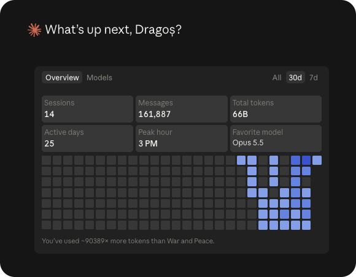

# How Peel was made

I made Peel in three weeks, from September 18 to October 8, 2026, with Claude Code, on two accounts with the Max 20x
plan. The rules it was made by are now in [AGENTS.md](../AGENTS.md): prove a problem on a Mac before changing
anything, write a test that fails first, and check the result where it shows.

  

The picture is Claude Code's own overview of my last 30 days, most of it spent on Peel: 14 sessions, 161,887
messages, and 66 billion tokens over 25 active days, with Opus 5.5 as the favorite model.

- **Time:** three weeks, September 18 to October 8, 2026.
- **Commits:** 1,708: 764 before this repository started again on September 24, and 944 in it, this page the last
  of them.
- **Code:** 97,169 lines of Swift in 616 files.
- **Tests:** 1,872 in the package's suite, in 181 files.
- **Languages:** English and 17 others.
